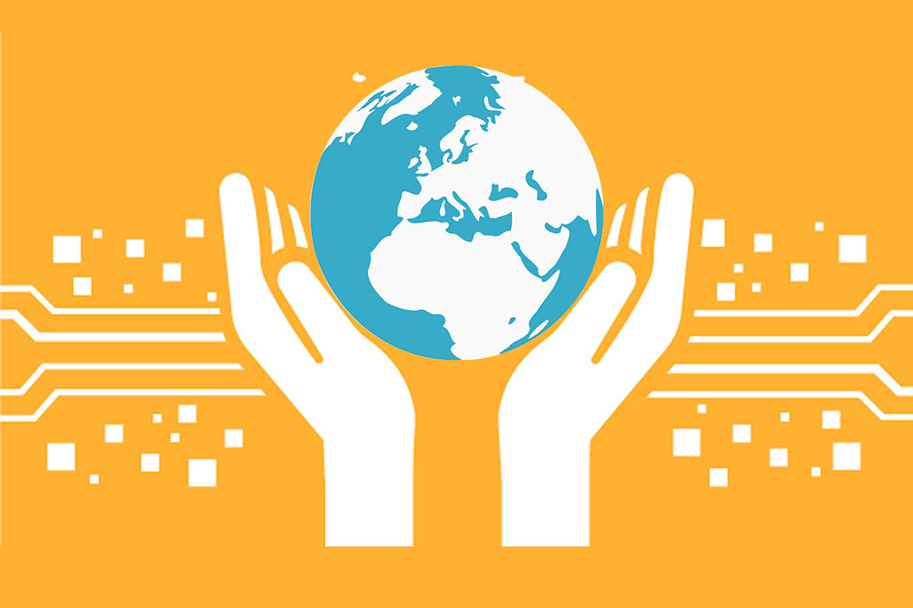

[Home](index.html) | [About](about.html) | [Contact](contact.html) | [Experience](experience.html)

# Who am I?

I'm a current junior at UC Berkeley majoring in Electrical Engineering and Computer Science. I'm passionate about using my skills to have positive impact on both my local communities and on a larger scale. When I'm not busy doing school projects, teaching classes, or doing research, you can probably find me crafting or performing! I like to stretch my brain and stay well rounded.

## Resume
Heres a link to my most updated [CV](CV_website.pdf) as of September 2020. Happy reading!

## Values

I am a firm believer in community and the responsibility we all have to uplift our fellow participants in society. I am not passionate about tech so much as I am passionate about its ability to make positive social change, regardless of how direct that may be. I want to build products that improve our world and work with teams who value sustainability, ethics, and inclusion.

## Goals and Interests

As a student, the goals I have are limitless, great in numbers, and often undefined. Research has treated me well, and I'm ready to explore more industry oriented areas as well. Overall, however, my goals are less oriented around career milestones or working in specific subdivisions of computer science–rather, I am oriented on the impact that my projects might have. All I want is to work on projects that I find valuable and interesting. I would love to work with a team that is making positive impact on the world.

