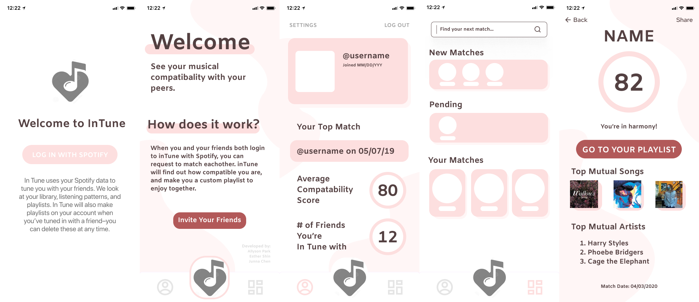
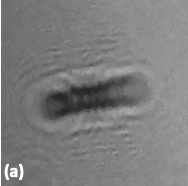
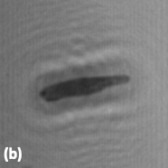
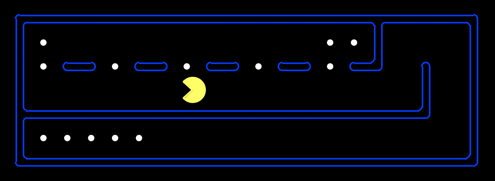

[Home](index.html) | [About](about.html) | [Contact](contact.html) | [Experience](experience.html)

# Experience

I changed my major from bioengineering to computer science midway through my second year of school, hence the short-ish list of projects available. Since discovering my new passion, however, I've spent plenty of time getting hands on experience in the world of computers. I'm always looking for ways to expand to this list and add new projects!

## iOS Development Example: inTune
This project is still in development. InTune is an iOS application that allows two Spotify users to log in and get a compatibility score and a joint playlist of songs that they would enjoy listening to together. Below show some images of a few of the main pages of the app.

## IBM Summer Research Project: Autofocusing a Digital Holographic Microscope
Details of this project, including code, are confidential. Basic ideas to power this project include: image/video processing and manipulation, supervised machine learning, building command line applications, and building and working with large datasets.

Unfocused/Raw Images Collected From Holographic Microscope | Auto-focused Image Using Algorithm Developed Over Summer
-------| -----------
|

## Search Problems Applied To Pacman: Designing an Effective Heuristic
This project completed as part of the Berkeley course CS188: Introduction To Artificial Intelligence. Graphics and base code largely authored by CS188 Course Staff. I implemented depth first search, breadth first search, uniform cost search, A* search, and greedy search. I also implemented set up of the food search problem, which defines Pacman's goal as eating all the food (as opposed to a general maze solving problem). My algorithm solves the below food search problem in 6.8 seconds with only 4436 nodes of the search tree expanded. This is compared to the naive solution, which takes 13 seconds and expands over 16,000 nodes. As a school project, code must be private and can be shared upon request.

