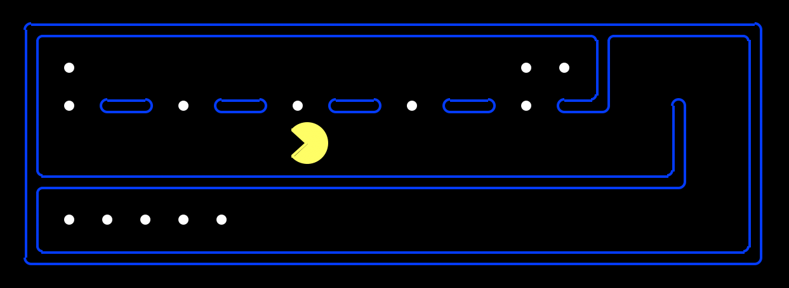

## HP Instant Ink
HP Instant Ink is a subscription service that allows users with eligible printers to pay a flat monthly rate for ink delivery to their doorstep whenever their printer detects that ink is low. Instant Ink services over 12+ million customers, with around 4-6K users going through our enrollment flow daily. Since 2022, I've worked with the Instant Team to create new and optimized signup flows, maintain our existing database of subscriptions, and add feature support to meet business goals.

    
 
        Examples of work:
    

    <ul>
        <li>Created a new enrollment flow for web with a successful global launch</li>
        <li>Added support for payment via PayPal within a webview-based application context, utilizing the PayPal SOAP APIs. The initial design plan for the flow contained several UX and data integrity gaps, which I noticed, and so I presented an alternative design that resolved them. Through these suggestions, I ended up serving as the POC to coordinate and answer questions across frontend, backend, design, and business/legal teams. </li>
        <li>Created new Splunk dashboards for monitoring deployed code and caught bugs on production that would have otherwise gone unnoticed.</li> 
        <li>Played key role in initiative to fix errors in customer tax ID validation. Business administration provided what they thought would be a corrected validation script, but rather than just implementing it as asked, I took time to validate it against existing users and found inconsistencies. There were several rounds of back and forth to find a better script, during which time I repeatedly caught errors in scripts that others had given the green light. I researched and translated various tax ID validation libraries and provided this data to the business side, who utilized it to make an informed decision.</li> 
        <li>Made improvements to our various documentation pages and UI demo pages for internal use. This included changes to Readme files, Github wiki pages, openAPI Swagger documentation, and Storybook UI demo pages.</li> 
        <li>Hosted a "tech talk" workshop to teach my team how to use step-through debugging tools, increasing the team's overall efficiency. Even members with 10 and 30+ years of experience learned something new!</li>
    </ul>

## Game development sample: Passing
Passing is a small RPG game in which the player controls a ghost who must do good deeds in order to reach the afterlife. The player can possess townspeople and interfere to bring them closer to their goals. I came up with the game concept and led a team of 4 other developers and artists to create our working game with Unity engine and C#. In addition to being the project manager, I also served as a lead developer, wrote all the game dialogue and interactions, created the character art assets (including animations) and composed the soundtrack.

The game is playable on [itch.io](https://glumfrog.itch.io/passing) for free. The trailer is linked below.

## iOS Development Example: inTune
This project is still in development. InTune is an iOS application that allows two Spotify users to log in and get a compatibility score and a joint playlist of songs that they would enjoy listening to together. Below show some images of a few of the main pages of the app. In addition to serving as one of the 2 devs on this project, I also did the UI and UX design using Figma.

## IBM Summer Research Project: Autofocusing a Digital Holographic Microscope
As an intern at IBM, I researched mechanisms for autofocusing a digital holographic microscope. The paper is available as a part of the [SPIE Digital Library](https://www.spiedigitallibrary.org/conference-proceedings-of-spie/11710/2582798/Evaluating-autofocusing-metrics-for-plankton-holographic-microscope-image-reconstruction/10.1117/12.2582798.short). 

Basic ideas to power this project include: image/video processing and manipulation, supervised machine learning, building command line applications, and building and working with large datasets.

| Unfocused/Raw Images Collected From Holographic Microscope | Auto-focused Image Using Algorithm Developed Over Summer |
|------------------------------------------------------------|----------------------------------------------------------|
|                      |                        |

## PintOS: Pint-sized operating System
PintOS is an educational OS for the x86 architecture. Given the base PintOS source code, I worked in a team of 4 to add support for running user programs, multi-threading, and file system operations. The project was implemented in the C language. As a school project, code must be private and can be shared upon request.

The specifications for the assignment can be found on the [course website](https://cs162.org/static/proj/pintos-docs/).

## Search Problems Applied To PacMan: Designing an Effective Heuristic
This project completed as part of the Berkeley course CS188: Introduction To Artificial Intelligence. Graphics and base code largely authored by CS188 Course Staff. I implemented depth first search, breadth first search, uniform cost search, A* search, and greedy search. I also implemented set up of the food search problem, which defines PacMan's goal as eating all the food (as opposed to a general maze solving problem). My algorithm solves the below food search problem in 6.8 seconds with only 4436 nodes of the search tree expanded. This is compared to the naive solution, which takes 13 seconds and expands over 16,000 nodes. As a school project, code must be private and can be shared upon request.

## Publications from Bondy-Denomy Laboratory
Before worrying about viruses that affected _computers_, I spent my days worrying about viruses that affected _bacteria_ (bacteriophages). You may have heard of CRISPR-Cas9, a type of bacterial immune system that rose to fame for its usage in genetic engineering. My researched involved discovering new _anti-CRISPR_ proteins, which naturally occur in bacteriophages and inhibit CRISPR-Cas9. Applications of anti-CRISPR proteins include:
* Increasing precision in CRISPR-Cas9 gene editing
* Detecting if a given bacteria strain utilizes a CRISPR-Cas9 immune system
* Arming bacteriophages for "phage therapy", a strategy for eliminating antibiotic-resistant bacterial infections.

Publications are linked here:
* [Machine-learning approach expands the repertoire of anti-CRISPR protein families](https://pubmed.ncbi.nlm.nih.gov/32728052/)
* [Mobile element warfare via CRISPR and anti-CRISPR in Pseudomonas aeruginosa](https://pubmed.ncbi.nlm.nih.gov/33544853/)